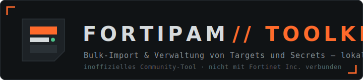

<p align="center">
  
</p>

<p align="center">
  <a href="https://github.com/xozy22/FortiPAM-Toolkit/actions/workflows/ci.yml"></a>
  <a href="LICENSE"></a>
  
  
  
  
</p>

<p align="center"><b>Deutsch</b> · <a href="README.en.md">English</a></p>

> **Disclaimer:** Dies ist ein **inoffizielles Community-Tool** und steht in
> keiner Verbindung zu Fortinet Inc. Es ist kein offizielles Fortinet-Produkt,
> wird von Fortinet weder unterstützt noch geprüft. „Fortinet" und „FortiPAM"
> sind Marken der Fortinet Inc. Nutzung auf eigene Verantwortung — vor dem
> Einsatz auf Produktivsystemen bitte gegen eine Test-/Demo-Instanz prüfen.
>
> *This is an unofficial community tool, not affiliated with, endorsed, or
> supported by Fortinet Inc. Use at your own risk.*

---

Lokales Windows-Tool für die Massenverwaltung von **Targets** und **Secrets**
auf einem Fortinet **FortiPAM**. Excel- oder CSV-Liste rein, Mapping
konfigurieren, Vorschau prüfen, bulk erstellen — inklusive dreifacher
Duplikat-Absicherung und ohne dass ein Passwort das eigene Netz verlässt.
Getestet gegen FortiPAM **v1.9.0/v1.9.1** (Mock-Suite mit 64 Checks plus
Live-Gerät).

## Funktionen

### Inventar
- Vollständiger Bestand: Targets, Secrets, Ordner, Templates,
  Klassifizierungen — seitenweise geladen, auch bei großen Beständen stabil
- **Ordner als auf-/zuklappbarer Baum** mit Secret-Zählern je Ordner
  (direkt + inklusive Unterordner)
- **Filtern per Klick**: Werte in der Tabelle (Ordner, Template, Target, …)
  anklicken oder im **„+ Filter"-Menü** wählen (alle Werte mit Trefferzahlen,
  Mehrfachauswahl per Haken) — jeder Filter wird als **Chip** angezeigt und
  einzeln entfernbar. Mehrere Chips derselben Spalte = ODER, verschiedene
  Spalten = UND, frei mit der Textsuche kombinierbar (Enter hält die
  Eingabe als Chip fest)
- **Suchsyntax** für Power-User (eingebaute Hilfe per „?"): `spalte:wert`,
  `-begriff` (ausschließen), `a|b` (oder), `"Phrase mit Leerzeichen"`
- **Sortierbare Spalten** (Klick auf den Spaltenkopf), Trefferzähler und
  Ein-Klick-Reset
- **„Sichtbar / gesamt"-Anzeige**: deckt auf, wenn dem API-User Berechtigungen
  fehlen (FortiPAM filtert Secrets und Ordner pro Benutzer)
- **Detailansicht** per Klick auf jede Zeile — sensible Feldwerte (Passwörter,
  Passphrasen, Private Keys) werden serverseitig maskiert
- **Bulk-Löschen** mit Checkbox-Auswahl, doppelter Bestätigung und
  Live-Protokoll (Reihenfolge: Secrets → Targets → Ordner)
- **Excel-Export** des gesamten Bestands (ein Blatt je Objekttyp)

### Bulk-Import
- **Excel (.xlsx) oder CSV** einlesen — Trennzeichen und Encoding werden bei
  CSV automatisch erkannt, Spaltennamen sind frei wählbar
- **Mapping-Assistent** mit automatischer Spaltenerkennung: freie Secret-Typen
  (z. B. `linux`, `windows`) werden FortiPAM-Templates zugeordnet, Feldnamen
  (Benutzername, Passwort, Domäne …) den Template-Feldern
- **Vorlagen-Generator**: erzeugt eine Import-Vorlage passend zu den Templates
  des eigenen Geräts (Spalten = echte Feldnamen)
- **Mapping-Profile**: komplette Konfiguration als JSON speichern und
  wiederverwenden — ideal für wiederkehrende Importe
- Ziel-Ordner fest, als fester Pfad oder aus einer Spalte (`Linux/Prod`);
  fehlende Ordner werden automatisch angelegt (inkl. Owner-Regel für
  Root-Ordner)
- **Passwort-Generator**: leere Pflicht-Passwortfelder erhalten starke
  Zufallswerte (Länge 8–64 einstellbar)
- **Secret-Optionen** pro Import: Checkout, Sitzungs-Aufzeichnung,
  Password-Changer und Passwort-Heartbeat fest setzbar
- **Vorschau vor jeder Änderung**: Plan mit Aktionen (erstellen / existiert /
  Fehler), Warnungen je Zeile, Passwörter maskiert
- **Parallele Ausführung** (6 Worker) mit automatischem Retry bei
  Rate-Limits (HTTP 429) und Live-Fortschritt

### Duplikat-Absicherung (dreifach)
1. **Name + Ordner** gegen den gelisteten Bestand
2. **Live-Einzelprüfung** pro Target-Name — fängt das Konsistenzfenster des
   Geräts nach Bulk-Läufen ab (Einzelabfragen sind sofort konsistent)
3. **Geräteseitige Prüfung** Benutzername + Zieladresse über die Internal-API
   (`secret-dup-check`) — findet bestehende Zugänge auch unter anderem Namen
   und über Berechtigungsgrenzen hinweg

### Verbindungsmanager
- **Mehrere FortiPAM-Systeme** als benannte Profile speichern (z. B.
  „PAM Produktion", „PAM Test") und per Dropdown umschalten
- Der API-Token wird je Profil **DPAPI-verschlüsselt** abgelegt (an das
  Windows-Benutzerkonto gebunden); Wiederverbinden ohne erneute Token-Eingabe
- Zuletzt genutztes Profil wird beim Start vorausgewählt; Profile einzeln
  löschbar (entfernt auch den gespeicherten Token)

### Oberfläche
- **Zweisprachig (Deutsch / English)** — Umschalter oben rechts, Auswahl wird
  gespeichert; auch servergenerierte Meldungen (Plan-Warnungen, Fehler) folgen
  der Sprache. Nutzerdaten (Spaltennamen, Objektnamen) bleiben unverändert.

### Sicherheit
- Läuft ausschließlich auf `127.0.0.1` — keine Cloud, keine Telemetrie,
  keine externen CDNs (funktioniert in Netzen ohne Internetzugang)
- API-Token standardmäßig **nur im Arbeitsspeicher**; optional je Profil
  **DPAPI-verschlüsselt** gespeichert (an das Windows-Benutzerkonto gebunden,
  `%APPDATA%\FortiPAM-Toolkit\connections.json`)
- Passwörter erscheinen weder in Vorschau noch Detailansicht im Klartext

## Schnellstart

**Variante A — mit Python (empfohlen für Entwicklung):**

1. [Python 3.11+](https://www.python.org/downloads/) installieren
2. `start.bat` doppelklicken — beim ersten Start werden die Abhängigkeiten in
   eine virtuelle Umgebung installiert, danach öffnet sich der Browser
   automatisch (Port 8420)

**Variante B — portable EXE:**

Fertige EXE von der [Releases-Seite](https://github.com/xozy22/FortiPAM-Toolkit/releases)
herunterladen (wird bei jedem Release automatisch gebaut und smoke-getestet) —
oder selbst bauen:

```
build_exe.bat
```

erzeugt `dist\FortiPAM-Toolkit.exe` (~15 MB, kein Python auf dem Zielrechner
nötig). Die EXE ist unsigniert — SmartScreen beim ersten Start mit „Weitere
Informationen → Trotzdem ausführen" bestätigen.

## FortiPAM vorbereiten

### REST-API-Admin anlegen

1. FortiPAM-GUI: `System › Administrator › Create New › REST API Admin`
2. Administratorprofil mit Lese-/Schreibrechten auf den Secrets-Bereich
   zuweisen (`secgrp` bzw. entsprechendes Zugriffsprofil)
3. **Trusted Hosts** auf die IP des Toolkit-Rechners setzen
4. Den einmalig angezeigten **API-Schlüssel** in der App eintragen

### Ordner-Berechtigungen (wichtig!)

FortiPAM filtert Secrets und Ordner **pro Benutzer** — unabhängig vom
Administratorprofil. Der API-User sieht nur Objekte, auf die er per
`user-permission` berechtigt ist. Damit das Toolkit bestehende Bestände sieht:
In der GUI den obersten Ordnern unter *Permissions* den API-User mit Ordner-
und Secret-Berechtigung hinzufügen (Unterordner erben bei aktiver Vererbung).
Das Inventar zeigt „sichtbar / gesamt" und warnt, wenn Einträge fehlen.
Vom Toolkit angelegte Root-Ordner erhalten den API-User automatisch als Owner.

### Verbindungen verwalten

Oben in der Verbindungsmaske lassen sich mehrere FortiPAM-Systeme als
**benannte Profile** ablegen und über das Dropdown „Gespeicherte Verbindung"
umschalten:

- **Neue Verbindung**: Name, URL und Token eingeben, „Verbindung speichern"
  aktiviert lassen und verbinden — das Profil wird angelegt.
- **Vorhandenes Profil nutzen**: im Dropdown wählen; URL/VDOM füllen sich
  automatisch. Das Token-Feld bleibt leer — der gespeicherte Token wird
  verwendet (nur eingeben, wenn er sich geändert hat).
- **Profil löschen**: Profil wählen und „Löschen" — entfernt auch den
  gespeicherten Token.

Der Token wird je Profil **DPAPI-verschlüsselt** unter
`%APPDATA%\FortiPAM-Toolkit\connections.json` abgelegt — entschlüsselbar nur
vom angemeldeten Windows-Benutzer auf diesem Rechner. Ohne „Verbindung
speichern" bleibt der Token nur im Arbeitsspeicher der laufenden Sitzung.
Eine ältere Einzel-Ablage (`connection.json`) wird beim ersten Start
automatisch als Profil „Standard" übernommen.

## Ablauf

1. **Verbindung** — Profil wählen oder neu anlegen (URL + API-Token,
   TLS-Prüfung optional, VDOM optional)
2. **Inventar** — Bestand sichten, exportieren, Details ansehen, aufräumen
3. **Bulk-Import**
   1. *Datei*: Excel/CSV hochladen oder Vorlage generieren
   2. *Mapping*: Secret-Typ → Template, Ziel-Ordner, Felder, Optionen
      (automatisch vorbelegt; als Profil speicherbar)
   3. *Vorschau*: Plan prüfen — nichts wird ohne diesen Schritt geschrieben
   4. *Ausführung*: Ordner → Targets → Secrets mit Live-Protokoll

### Beispiel-Datei

| Name | Adresse | Secret-Typ | Benutzername | Passwort | Domäne | Ordner |
|------|---------|-----------|--------------|----------|--------|--------|
| srv-linux-01 | 10.10.1.21 | linux | root | … | | Linux/Produktion |
| srv-win-01 | 10.10.2.15 | windows | Administrator | … | corp.example.com | Windows/Produktion |

Spaltennamen sind frei — die Zuordnung passiert im Mapping. Eine Beispieldatei
und der geräte-spezifische Vorlagen-Generator sind in der App verfügbar.
Maximal 5000 Zeilen pro Datei.

## FortiPAM-API-Eigenheiten

Am echten Gerät (v1.9.0/1.9.1) verifizierte Abweichungen vom CMDB-Schema —
alle im Toolkit berücksichtigt:

<details>
<summary><b>Listing von Targets/Templates ist besonders</b> (aufklappen)</summary>

- Das normale Collection-GET auf `secret/target` und `secret/template` liefert
  für **jeden** Auth-Weg (auch GUI-Session) den Fehler
  „Unable to get mkey from uri".
- Die GUI — und dieses Toolkit — listet stattdessen per **`POST` mit Header
  `X-HTTP-Method-Override: GET`** und Body `{"json_filter": []}`. Damit kommt
  die vollständige Liste, bei Templates sogar inklusive solcher ohne
  „create secret"-Berechtigung. Der Body unterstützt auch serverseitige
  Filter: `{"json_filter": [{"logic": "and", "filters": [{"key": "…",
  "type": "string", "operator": "exact", "pattern": "…"}]}]}`.
- Dieser Mechanismus ist **undokumentiert** (nicht im offiziellen FPAM-SDK) und
  wurde durch Mitschneiden der GUI-Requests ermittelt — das Toolkit hat daher
  eine Fallback-Kette: normales GET → Override-POST → Einzelabfragen über
  Kandidatenlisten.
- `secret/database`, `secret/folder` und `secret/classification-tag` erlauben
  das normale Collection-GET (inkl. `start`/`count`-Pagination).

</details>

<details>
<summary><b>Konsistenzfenster, Pflichtfelder, Root-Regeln</b> (aufklappen)</summary>

- **Konsistenzfenster:** Das Target-Listing hinkt nach Bulk-Erstellungen
  einige Sekunden hinterher. Die Duplikat-Prüfung des Toolkits verlässt sich
  deshalb nie allein aufs Listing, sondern prüft unbekannte Namen einzeln
  (Einzelabfragen sind sofort konsistent).
- **POST wendet keine Defaults an:** `secret/folder` und `secret/database`
  verlangen u. a. `inherit-permission` explizit im Payload.
- **Ordner direkt unter Root:** `inherit-permission` muss `disable` sein und
  eine `user-permission` mit `folder-permission: owner` ist Pflicht.
- **Secrets können nicht in Root liegen** (`folder_id can't be 0`) — es ist
  immer ein Unterordner nötig.
- **Templates mit Pflichtfeld vom Typ `target-address`** (z. B. „Host")
  brauchen eine Target-Referenz, sonst lehnt das Gerät mit „Mandatory field
  missing" ab — das Toolkit warnt bereits in der Vorschau.
- Template-Einzelabfragen liefern **403 auch für nicht existierende Namen**,
  wenn die „create secret"-Berechtigung fehlt — nur 200 ist verlässlich.
- Die Envelope-Felder `size` (gesamt) und `matched_count` (sichtbar) machen
  Berechtigungslücken messbar.
- Nützliche Zusatz-APIs mit derselben Bearer-Auth:
  `POST /api/v2/internal/secret-dup-check` (409 = Duplikat zu
  Benutzer + Zieladresse), `secret-checkout`/`secret-checkin`/
  `secret-clear-text` sowie `GET /api/v2/utility/id/{pfad}?type=secret|folder`.

</details>

## Entwicklung & Tests

`dev\mock_fortipam.py` simuliert die FortiPAM-API auf `http://127.0.0.1:9443`
inklusive aller oben beschriebenen Eigenheiten (gesperrtes Listing,
Override-Route, Root-Regeln, Rate-Limits, Duplikat-Prüfung).
`dev\e2e_test.py` fährt den kompletten Ablauf mit **70 Checks** ab,
`dev\test_planner.py` enthält Unit-Tests für die Plan-Logik:

```
.venv\Scripts\python.exe -m pytest dev\test_planner.py    (Unit-Tests)
.venv\Scripts\python.exe dev\mock_fortipam.py             (Terminal 1)
start.bat                                                  (Terminal 2)
.venv\Scripts\python.exe dev\e2e_test.py                  (Terminal 3)
```

Beide Suiten laufen per **GitHub Actions** bei jedem Push (Windows-Runner,
siehe CI-Badge). Ein Git-Tag `v*` baut automatisch die EXE, testet sie und
veröffentlicht sie als GitHub-Release.

**Technik:** FastAPI + httpx (Backend), Vanilla JS ohne Build-Schritt
(Frontend), openpyxl (Excel). Die CMDB-Schema-Referenz ist nicht Teil des
Repos (geräte-spezifischer Dump) — bei Bedarf vom eigenen Gerät abrufbar:
`GET /api/v2/cmdb?action=schema`.

### Projektstruktur

```
app/
  main.py        FastAPI-Endpunkte, Verbindungsmanager, Inventar, Jobs
  fortipam.py    REST-Client (Pagination, Override-Fallback, Retry)
  planner.py     Plan-Erstellung, Validierung, parallele Ausführung
  excel_io.py    Excel-/CSV-Parser, Vorlagen, Export
  winsec.py      DPAPI-Verschlüsselung (Token-Ablage je Profil)
  i18n.py        Sprachumschaltung für servergenerierte Meldungen
  static/        Oberfläche (index.html, app.js, style.css, i18n.js)
dev/             Mock-FortiPAM + E2E-Testsuite
start.bat        Start inkl. Einrichtung der virtuellen Umgebung
build_exe.bat    Portable EXE per PyInstaller
```

## Lizenz

[MIT](LICENSE) © 2026 Dennis Kobiolka — Beiträge und Issues willkommen.
